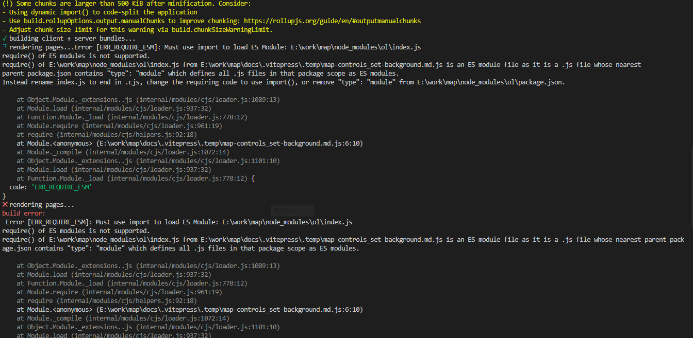

# Map

通过 `openlayer` 或者 `leaflet` 渲染地图，并实现功能交互。

本文档基于 [VitePress](https://vitepress.vuejs.org/) 构建

# 线上地址

http://map.raomaiping.host/

# 技术栈

vue3 + openlayers + leaflet 
# 运行 

yarn docs:dev

# 打包
先删除 node_modules/ol/package.json  里面的 "type": "module",不然会产生打包错误。\
如图：

## 删除之后在运行构建命令

yarn docs:build

